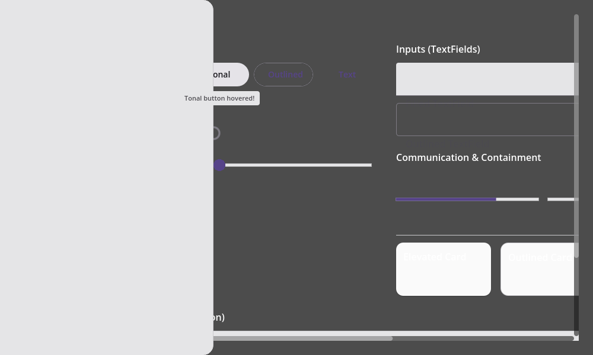
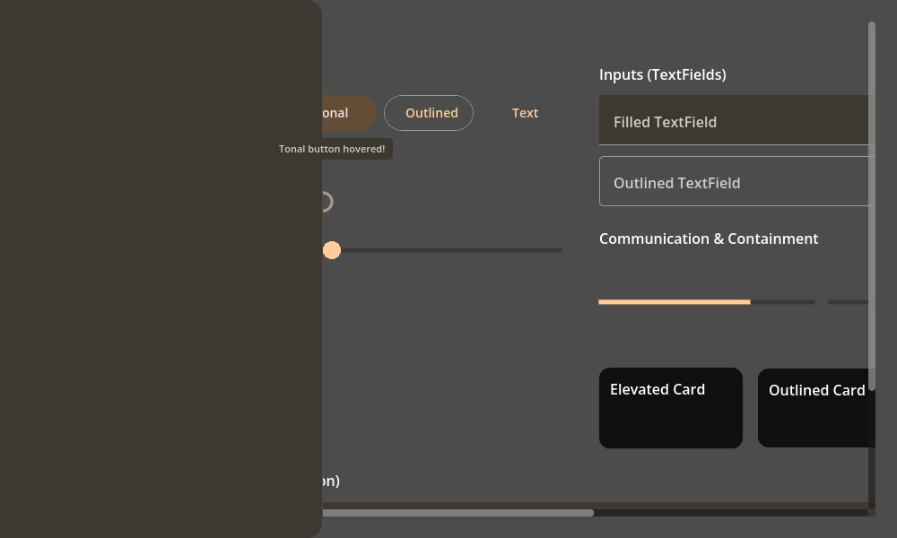
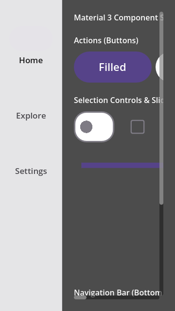

# Material Design 3 UI Library for Godot 4 (C#)

[](https://opensource.org/licenses/MIT)
[](https://godotengine.org)
[](https://dotnet.microsoft.com/)

A premium, native C# implementation of the complete **Material Design 3 (M3)** design system for the **Godot Engine (4.6+)**. Features a dynamic, hardware-aware DPI scaling engine, click-through overlay handling, HSL seed-color palette generation, state-driven ripples, and 100% vector-drawn UI components.

---

## 🎨 Interactive Showcase

All controls are drawn procedurally via vector calculations for infinite, razor-sharp sharpness at any display density.

### Desktop Light Violet
*Demonstrates the dynamic slide-out `M3NavigationDrawer` overlaying the dashboard layout, with an active `M3Tooltip` centered below the hover target.*


### Desktop Dark Amber
*Demonstrates the automatic dark mode HSL palette calculation blending Surface, Outline, and Primary seed accents.*


### Mobile Light Violet (1.6x DPI Scale)
*Demonstrates vertical scrollable reflow and touch target expansion alongside a side-anchored `M3NavigationRail` on emulated high-density screens.*


---

## ✨ Features & Architecture

### 1. Dynamic DPI & Adaptive DP Scaling Framework
To prevent UI elements and typography from appearing tiny on high-resolution monitors (e.g. 4K, Retina) or emulated device viewports, the library integrates a hardware-aware scaling framework:
*   **Automatic Hardware DPI Calculation**: Queries `DisplayServer.ScreenGetDpi()` and standardizes it against a **96 DPI baseline** (`dpiScale = dpi / 96.0f`).
*   **Viewport-Adaptive Scaling**: Dynamically compares active visible sizes against a standard `1280x720` design baseline (`viewportScale = Mathf.Min(scaleX, scaleY)`).
*   **Dynamic DP Product**: Computes the final visual `ScaleFactor` as `dpiScale * viewportScale` (clamped between `1.0x` and `3.0x` for high-dpi readability).
*   **Auto-Reflow on Resize**: Hooks into the viewport's `SizeChanged` signal to automatically recalculate and reflow element dimensions, font sizes, container margins, and vector coordinates on the fly.
*   **Manual Emulator Overrides**: Supports manual emulator presets (Desktop `1.0x`, Tablet `1.25x`, Mobile Portrait `1.6x`) that cleanly bypass auto-recalculation for pixel-perfect sweeps.

### 2. Mouse Interaction & Input Handling
*   **Click-Through Overlays**: Large floating containers (such as the full-screen `M3NavigationDrawer` wrapper) set `MouseFilter = MouseFilterEnum.Ignore` on their root. Clicks cleanly pass through transparent regions, while input blocking is isolated exclusively to active visible bodies (`_contentPanel.MouseFilter = MouseFilterEnum.Stop`). Clicks and taps always reach the buttons, sliders, text fields, and switches behind them.
*   **Math.Clamp Safety Guards**: Tooltips, menus, and popups verify `min <= max` bounds before executing `Math.Clamp` operations, avoiding C# `.NET` exception crashes during early control setup frames where parent sizes are temporarily `0x0`.

### 3. State-Driven Animations
*   Standard mouse hover, focus, click, and drag states automatically transition visual HSL tints and trigger fluid, physics-based vector **Ripple Effects** originating directly from the tap coordinate.

---

## 📦 Complete Component Coverage (15 Controls)

1.  **`M3Button`**: Action buttons supporting Elevated, Filled, Tonal, Outlined, and Text styles.
2.  **`M3Switch`**: Toggle switches with animated sliding handles and state icons.
3.  **`M3Checkbox`**: Checkboxes with animated vector checks drawn via custom polylines.
4.  **`M3RadioButton`**: Concentric selection rings for mutually exclusive options.
5.  **`M3Slider`**: Continuous value tracks with interactive drag handles.
6.  **`M3ProgressIndicator`**: Determinate and Indeterminate progress bars (Linear and Circular).
7.  **`M3Card`**: Sized container wrappers featuring dynamic HSL surface borders and elevation shadows.
8.  **`M3Divider`**: Horizontal and vertical content separators with scaled line thicknesses.
9.  **`M3Badge`**: Notifications dots/pills supporting character and numeric scaling.
10. **`M3TextField`**: Input fields featuring float-scaling labels and vector outline cutouts.
11. **`M3NavigationBar`**: Bottom navigation bars with dynamic capsule selection sliders.
12. **`M3NavigationRail`**: Vertical side navigation bars optimized for medium-sized displays.
13. **`M3NavigationDrawer`**: Slide-out vertical edge drawers with rounded corners and slide tweens.
14. **`M3Tooltip`**: Hover-responsive overlays that auto-clamp and align inside parent screen boundaries.
15. **`M3TabBar` / `M3Tab`**: Tab systems with animated selection underlines.

---

## 🚀 Getting Started

### 1. Import the Library
1.  Copy the `material-3` directory into the root of your Godot project.
2.  Add the core C# class files to your `.csproj` target framework (requires `.NET 8.0`).

### 2. Configure the Autoload Singleton
To coordinate active theme states and dynamic scaling calculations, add the `M3ThemeManager` as an Autoload node:
1.  Open Godot: **Project > Project Settings > Autoloads**.
2.  Select `material-3/core/M3ThemeManager.cs`.
3.  Set the Node Name to `M3ThemeManager` and enable it.

### 3. Usage Example
To use a component in a scene, instantiate it via Godot's scene tree editor or build it procedurally via C#:

```csharp
using Godot;
using Material3.Components;

public partial class MyView : Control
{
    public override void _Ready()
    {
        // 1. Create a Material 3 Button procedurally
        var filledButton = new M3Button
        {
            Text = "Get Started",
            ButtonType = M3ButtonType.Filled,
            CustomMinimumSize = new Vector2(120, 40)
        };
        
        // 2. Connect pressed signal
        filledButton.Pressed += OnGetStartedPressed;
        AddChild(filledButton);
    }

    private void OnGetStartedPressed()
    {
        GD.Print("Button pressed!");
    }
}
```

---

## 🛠️ Visual Sweep Audit Tool

The repository includes a programmatic visual audit tool that resizes viewports, applies scaling factor multipliers, switches seed colors (Violet, Emerald, Amber, etc.), toggles dark mode, and saves PNG screenshots to disk. 

To execute the automated sweep sweep:
```bash
/Applications/Godot.app/Contents/MacOS/Godot --path material-3 res://scenes/M3Catalog.tscn -- --audit
```
*(Verify that the Godot executable path matches your local installation.)*

---

## 📄 License

This project is licensed under the MIT License - see the [LICENSE](LICENSE) file for details.
